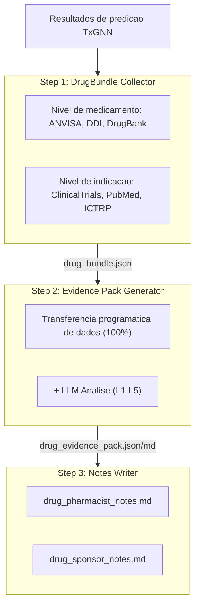
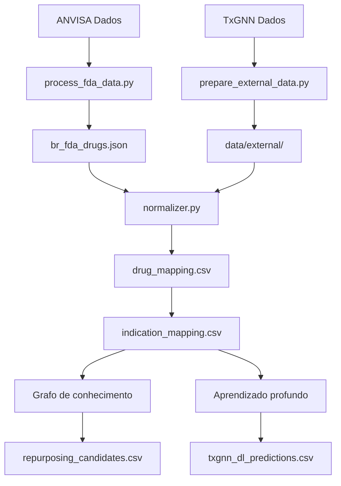

# BrTxGNN - Brasil: Reposicionamento de Medicamentos

[](https://brtxgnn.yao.care)
[](https://opensource.org/licenses/MIT)

Predicoes de reposicionamento de medicamentos para medicamentos aprovados pela ANVISA (Brazil) usando o modelo TxGNN.

## Aviso

- Os resultados deste projeto sao apenas para fins de pesquisa e nao constituem aconselhamento medico.
- Candidatos a reposicionamento de medicamentos requerem validacao clinica antes da aplicacao.

## Visao geral do projeto

### Estatisticas de relatorios

| Item | Quantidade |
|------|------|
| **Relatorios de medicamentos** | 256 |
| **Predicoes totais** | 17,788,744 |
| **Medicamentos unicos** | 770 |
| **Indicacoes unicas** | 17,041 |
| **Dados DDI** | 302,516 |
| **Dados DFI** | 857 |
| **Dados DHI** | 35 |
| **Dados DDSI** | 8,359 |
| **Recursos FHIR** | 256 MK / 2,404 CUD |

### Distribuicao dos niveis de evidencia

| Nivel de evidencia | Quantidade de relatorios | Descricao |
|---------|-------|------|
| **L1** | 0 | Multiplos ECRs de Fase 3 |
| **L2** | 0 | ECR unico ou multiplos Fase 2 |
| **L3** | 0 | Estudos observacionais |
| **L4** | 0 | Estudos pre-clinicos / mecanisticos |
| **L5** | 256 | Apenas predicao computacional |

### Por fonte

| Fonte | Predicoes |
|------|------|
| DL | 17,786,340 |
| KG + DL | 2,081 |
| KG | 323 |

### Por confianca

| Confianca | Predicoes |
|------|------|
| very_high | 1,522 |
| high | 883,214 |
| medium | 1,780,501 |
| low | 15,123,507 |

---

## Metodos de predicao

| Metodo | Velocidade | Precisao | Requisitos |
|------|------|--------|----------|
| Grafo de conhecimento | Rapido (segundos) | Menor | Sem requisitos especiais |
| Aprendizado profundo | Lento (horas) | Maior | Conda + PyTorch + DGL |

### Metodo do grafo de conhecimento

```bash
uv run python scripts/run_kg_prediction.py
```

| Metrica | Valor |
|------|------|
| ANVISA Total de medicamentos | 14,150 |
| Mapeados para DrugBank | 9,946 (70.3%) |
| Candidatos a reposicionamento | 2,404 |

### Metodo de aprendizado profundo

```bash
conda activate txgnn
PYTHONPATH=src python -m brtxgnn.predict.txgnn_model
```

| Metrica | Valor |
|------|------|
| Predicoes DL totais | 1,436,436 |
| Medicamentos unicos | 770 |
| Indicacoes unicas | 17,041 |

### Interpretacao de pontuacoes

A pontuacao TxGNN representa a confianca do modelo em um par farmaco-doenca, variando de 0 a 1.

| Limiar | Significado |
|-----|------|
| >= 0.9 | Confianca muito alta |
| >= 0.7 | Confianca alta |
| >= 0.5 | Confianca moderada |

#### Distribuicao de pontuacoes

| Limite | Significado |
|-----|------|
| ≥ 0.9999 | Confianca extremamente alta, predicoes mais confiantes do modelo |
| ≥ 0.99 | Confianca muito alta, vale priorizar para validacao |
| ≥ 0.9 | Confianca alta |
| ≥ 0.5 | Confianca moderada (fronteira de decisao sigmoide) |

#### Definicoes dos niveis de evidencia

| Nivel | Definicao | Significancia clinica |
|-----|------|---------|
| L1 | ECR de fase 3 ou revisao sistematica | Pode apoiar o uso clinico |
| L2 | ECR de fase 2 | Pode ser considerado para uso |
| L3 | Fase 1 ou estudo observacional | Requer avaliacao adicional |
| L4 | Relato de caso ou pesquisa pre-clinica | Ainda nao recomendado |
| L5 | Apenas predicao computacional, sem evidencia clinica | Requer pesquisa adicional |

#### Lembretes importantes

1. **Pontuacoes altas nao garantem eficacia clinica: as pontuacoes TxGNN sao predicoes baseadas em grafos de conhecimento que requerem validacao em ensaios clinicos.**
2. **Pontuacoes baixas nao significam ineficacia: o modelo pode nao ter aprendido certas associacoes.**
3. **Recomendado usar com o pipeline de validacao: utilize as ferramentas deste projeto para revisar ensaios clinicos, literatura e outras evidencias.**

### Pipeline de validacao



---

## Inicio rapido

### Passo 1: Baixar dados

| Arquivo | Download |
|------|------|
| ANVISA Dados | [Dados Abertos ANVISA - Medicamentos Registrados](https://dados.anvisa.gov.br/dados/DADOS_ABERTOS_MEDICAMENTOS.csv) |
| node.csv | [Harvard Dataverse](https://dataverse.harvard.edu/api/access/datafile/7144482) |
| kg.csv | [Harvard Dataverse](https://dataverse.harvard.edu/api/access/datafile/7144484) |
| edges.csv | [Harvard Dataverse](https://dataverse.harvard.edu/api/access/datafile/7144483) |
| model_ckpt.zip | [Google Drive](https://drive.google.com/uc?id=1fxTFkjo2jvmz9k6vesDbCeucQjGRojLj) |

### Passo 2: Instalar dependencias

```bash
uv sync
```

### Passo 3: Processar dados de medicamentos

```bash
uv run python scripts/process_fda_data.py
```

### Passo 4: Preparar dados de vocabulario

```bash
uv run python scripts/prepare_external_data.py
```

### Passo 5: Executar predicao do grafo de conhecimento

```bash
uv run python scripts/run_kg_prediction.py
```

### Passo 6: Configurar ambiente de aprendizado profundo

```bash
conda create -n txgnn python=3.11 -y
conda activate txgnn
pip install torch==2.2.2 torchvision==0.17.2
pip install dgl==1.1.3
pip install git+https://github.com/mims-harvard/TxGNN.git
pip install pandas tqdm pyyaml pydantic ogb
```

### Passo 7: Executar predicao de aprendizado profundo

```bash
conda activate txgnn
PYTHONPATH=src python -m brtxgnn.predict.txgnn_model
```

---

## Recursos

### TxGNN Nucleo

- [TxGNN Paper](https://www.nature.com/articles/s41591-024-03233-x) - Nature Medicine, 2024
- [TxGNN GitHub](https://github.com/mims-harvard/TxGNN)
- [TxGNN Explorer](http://txgnn.org)

### Fontes de dados

| Categoria | Dados | Fonte | Nota |
|------|------|------|------|
| **Dados de medicamentos** | ANVISA | [Dados Abertos ANVISA - Medicamentos Registrados](https://dados.anvisa.gov.br/dados/DADOS_ABERTOS_MEDICAMENTOS.csv) | Brazil |
| **Grafo de conhecimento** | TxGNN KG | [Harvard Dataverse](https://dataverse.harvard.edu/dataset.xhtml?persistentId=doi:10.7910/DVN/IXA7BM) | 17,080 diseases, 7,957 drugs |
| **Base de dados de medicamentos** | DrugBank | [DrugBank](https://go.drugbank.com/) | Mapeamento de ingredientes de medicamentos |
| **Interacoes medicamentosas** | DDInter 2.0 | [DDInter](https://ddinter2.scbdd.com/) | Pares DDI |
| **Interacoes medicamentosas** | Guide to PHARMACOLOGY | [IUPHAR/BPS](https://www.guidetopharmacology.org/) | Interacoes de medicamentos aprovados |
| **Ensaios clinicos** | ClinicalTrials.gov | [CT.gov API v2](https://clinicaltrials.gov/data-api/api) | Registro de ensaios clinicos |
| **Ensaios clinicos** | WHO ICTRP | [ICTRP API](https://apps.who.int/trialsearch/api/v1/search) | Plataforma internacional de ensaios clinicos |
| **Literatura** | PubMed | [NCBI E-utilities](https://eutils.ncbi.nlm.nih.gov/entrez/eutils/) | Pesquisa de literatura medica |
| **Mapeamento de nomes** | RxNorm | [RxNav API](https://rxnav.nlm.nih.gov/REST) | Padronizacao de nomes de medicamentos |
| **Mapeamento de nomes** | PubChem | [PUG-REST API](https://pubchem.ncbi.nlm.nih.gov/docs/pug-rest) | Pesquisa de sinonimos quimicos |
| **Mapeamento de nomes** | ChEMBL | [ChEMBL API](https://www.ebi.ac.uk/chembl/api/data) | Base de dados de bioatividade |
| **Padroes** | FHIR R4 | [HL7 FHIR](http://hl7.org/fhir/) | MedicationKnowledge, ClinicalUseDefinition |
| **Padroes** | SMART on FHIR | [SMART Health IT](https://smarthealthit.org/) | Integracao EHR, OAuth 2.0 + PKCE |

### Downloads de modelos

| Arquivo | Download | Nota |
|------|------|------|
| Modelo pre-treinado | [Google Drive](https://drive.google.com/uc?id=1fxTFkjo2jvmz9k6vesDbCeucQjGRojLj) | model_ckpt.zip |
| node.csv | [Harvard Dataverse](https://dataverse.harvard.edu/api/access/datafile/7144482) | Dados de nos |
| kg.csv | [Harvard Dataverse](https://dataverse.harvard.edu/api/access/datafile/7144484) | Dados do grafo de conhecimento |
| edges.csv | [Harvard Dataverse](https://dataverse.harvard.edu/api/access/datafile/7144483) | Dados de arestas (DL) |

## Introducao ao projeto

### Estrutura de diretorios

```
BrTxGNN/
├── README.md
├── CLAUDE.md
├── pyproject.toml
│
├── config/
│   └── fields.yaml
│
├── data/
│   ├── kg.csv
│   ├── node.csv
│   ├── edges.csv
│   ├── raw/
│   ├── external/
│   ├── processed/
│   │   ├── drug_mapping.csv
│   │   ├── repurposing_candidates.csv
│   │   ├── txgnn_dl_predictions.csv.gz
│   │   └── integration_stats.json
│   ├── bundles/
│   └── collected/
│
├── src/brtxgnn/
│   ├── data/
│   │   └── loader.py
│   ├── mapping/
│   │   ├── normalizer.py
│   │   ├── drugbank_mapper.py
│   │   └── disease_mapper.py
│   ├── predict/
│   │   ├── repurposing.py
│   │   └── txgnn_model.py
│   ├── collectors/
│   └── paths.py
│
├── scripts/
│   ├── process_fda_data.py
│   ├── prepare_external_data.py
│   ├── run_kg_prediction.py
│   └── integrate_predictions.py
│
├── docs/
│   ├── _drugs/
│   ├── fhir/
│   │   ├── MedicationKnowledge/
│   │   └── ClinicalUseDefinition/
│   └── smart/
│
├── model_ckpt/
└── tests/
```

**Legenda**: 🔵 Desenvolvimento do projeto | 🟢 Dados locais | 🟡 Dados TxGNN | 🟠 Pipeline de validacao

### Fluxo de dados



---

## Citacao

Se voce utilizar este conjunto de dados ou software, por favor cite:

```bibtex
@software{brtxgnn2026,
  author       = {Yao.Care},
  title        = {BrTxGNN: Drug Repurposing Validation Reports for Brazil ANVISA Drugs},
  year         = 2026,
  publisher    = {GitHub},
  url          = {https://github.com/yao-care/BrTxGNN}
}
```

Cite tambem o artigo original do TxGNN:

```bibtex
@article{huang2023txgnn,
  title={A foundation model for clinician-centered drug repurposing},
  author={Huang, Kexin and Chandak, Payal and Wang, Qianwen and Haber, Shreyas and Zitnik, Marinka},
  journal={Nature Medicine},
  year={2023},
  doi={10.1038/s41591-023-02233-x}
}
```
